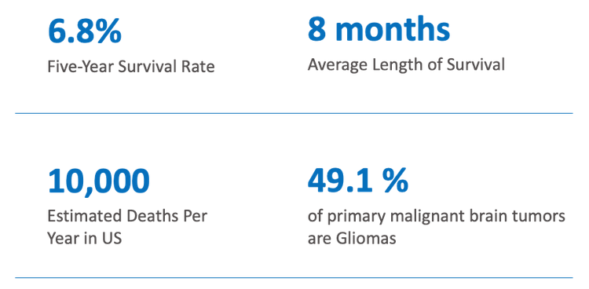
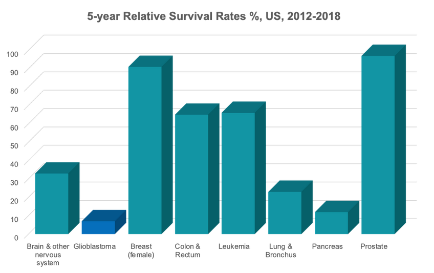

# Rice D2K DSCI 535 Capstone Summer 2023, TeamCV Biomedical Imaging


## Team Members
Huafeng Liu, Ben Dowdell, Todd Engelder, Nicolas Oso, Keith Pulmano, Zida Wang

## Contents

1. [Repository Structure](#repository-structure)
1. [Python Environment Set-up](#python-environment-set-up)
1. [Description](#description)
1. [Data](#data)
1. [Data Science Pipeline](#data-science-pipeline)

## Repository Structure

```
BioCV_Su23/
├── data
├── img
│   └── general
├── fitted_models
│   └── autoencoder
└── src
    ├── auth
    ├── models
    ├── notebooks
    ├── utils
    └── visualization
```

* `data/` directory containing instructions to retrieve the dataset
* `img/` directory for saving images used in analyses, presentations, and reports
* `fitted_models/` directory containing fitted model weights for re-use
* `src/` directory contains all source code
    * `auth/` directory contains information for connecting to Google storage
    * `models/` directory contains python modules for custom model implementations
    * `notebooks/` directory contains jupyter notebooks used for prototyping our ideas
    * `utils/` directory contains python modules for various custom routines such as data retrieval, data wrangling, and metrics
    * `visualization/` directory contains python modules for custom visualization functions


## Python Environment Set-up

1. Required `python --version`: Python 3.10.12
2. Package requirements: `requirements.txt`

There are two optional ways to set up your environment:

1. Using Linux (and MacOS) with Pyenv, Venv, and Pip
1. Using Linux/Windows/MacOS with Anaconda/Miniconda

### Option 1: Linux + Pyenv + Venv + Pip

The following instructions for setting up a virtual environment assume you are using Linux (or Windows Subsystem for Linux 2), and specifically, Ubuntu 20.04.6 LTS. The overall sequence of steps are:

1. Install and set-up `pyenv` for managing different python versions
2. Clone the `BioCV_Su23` repository
3. Set-up a new virtual environment using `venv`
4. Install required packages using `pip` and the `requirements.txt` file

**Note**: Prior to installing anything, ensure your Ubuntu is up-to-date. Open a terminal and:

```
$ sudo apt update
$ sudo apt upgrade
```

*The following steps are all completed from within a terminal*

#### Step 1: Install and set-up `pyenv`

For full details, please refer to the `pyenv` [github repository](https://github.com/pyenv/pyenv#getting-pyenv). The steps are as follows:

1. Ensure you are in your home directory: `$ cd`
2. Clone the `pyenv` repository: `$ git clone https://github.com/pyenv/pyenv.git ~/.pyenv`
3. Set up your shell for Pyenv:
    * `$ echo 'export PYENV_ROOT="$HOME/.pyenv"' >> ~/.bashrc`
    * `$ echo 'command -v pyenv >/dev/null || export PATH="$PYENV_ROOT/bin:$PATH"' >> ~/.bashrc`
    * `$ echo 'eval "$(pyenv init -)"' >> ~/.bashrc`
4. Repeat the above for `.profile`:
    * `$ echo 'export PYENV_ROOT="$HOME/.pyenv"' >> ~/.profile`
    * `$ echo 'command -v pyenv >/dev/null || export PATH="$PYENV_ROOT/bin:$PATH"' >> ~/.profile`
    * `$ echo 'eval "$(pyenv init -)"' >> ~/.profile`
5. Restart the shell: `$ exec "$SHELL"`
6. Install necessary Python build dependencies:

```
$ sudo apt update; sudo apt install build-essential libssl-dev zlib1g-dev \
libbz2-dev libreadline-dev libsqlite3-dev curl \
libncursesw5-dev xz-utils tk-dev libxml2-dev libxmlsec1-dev libffi-dev liblzma-dev
```
7. Install python version 3.10.12: `$ pyenv install 3.10.12`

*Note*: This will take a few minutes. Be patient, the process is not hung. 

#### Step 2: Clone the repository

1. `$ git clone https://github.com/RiceD2KLab/BioCV_Su23.git`


#### Step 3: Set-up `venv`

1. Change into the cloned repository: `$ cd BioCV_Su23`
2. Set the local python version: `$ pyenv local 3.10.12` $\leftarrow$ includes `venv` so we don't need to install first
3. Confirm the change: `$ python --version`
4. Create a virtual environment: `python -m venv .venv`
5. Activate the virtual environment: `$ source .venv/bin/activate`
6. When you are done working, *remember to deactivate the environment*: `$ deactivate`

#### Step 4: Install required packages

1. With the virtual environment active: `$ pip install -r requirements.txt`

*Note*: This will take a few minutes.

Your environment is now ready.

### Option 2: Linux/Windows/MacOS + conda (anaconda or miniconda)

*Note*: This method makes the virtual environment accessible to other projects as it creates a conda environment as opposed to a self-contained virtual environment specific to the project directory.

#### Step 1: Install either anaconda or miniconda

If you do not already have Anaconda or Miniconda installed, see below. Anaconda includes a number of packages useful for typical data science projects, while miniconda is a minimal installation. Either will work, you just need `conda` for environment management which is provided by both.

1. [Anaconda](https://www.anaconda.com/)
1. [Miniconda](https://docs.conda.io/en/latest/miniconda.html)

From this point forward, all steps are completed in a terminal. If you are working in Linux or MacOS, you can use a normal terminal. In Windows, you will either want to use AnacondaPrompt or PowerShell.

#### Step 2: Clone the repository

1. `$ git clone https://github.com/RiceD2KLab/BioCV_Su23.git`

#### Step 3: Create a conda Python 3.10.12 environment

1. `$ conda create -n biocv python=3.10.12`
1. Enter the project directory: `$ cd BioCV_Su23`
1. Activate your newly created conda environment: `$ conda activate biocv`
1. Update pip: `$ pip install update pip`

#### Step 4: Install required packages

1. `$ pip install -r requirements.txt`

*Note*: This will take some time.

Your new environment is now ready.

When you are done working, remember to deactivate to base: `$ conda deactivate`


## Description
Our team's capstone project focuses on the application of current state-of-the-art (SOTA) computer vision models to 3D MRI volumes of patients diagnosed with Glioblastoma cancer. Glioblastoma (GBM) is a very aggressive form of cancer, and "survival rates and mortality statistics for GMB **have been virtually unchanged** for decades." [Data source: BrainTumor.org](https://braintumor.org/events/glioblastoma-awareness-day/about-glioblastoma/)

[](https://braintumor.org/events/glioblastoma-awareness-day/about-glioblastoma/)

[](https://www.cancer.org/content/dam/cancer-org/research/cancer-facts-and-statistics/annual-cancer-facts-and-figures/2023/2023-cancer-facts-and-figures.pdf)

Our motivations include:

1. Advance diagnostic, treatment, and medical research
2. Test novel data science tools on 2D and 3D image data
3. Support exploration applications in the energy industry (image data idea transfer, such as 3D seismic data)

 Our objectives are to develop machine learning tools focused on:

1. Automated Brain Tumor Segmentation
2. Biomaker prediction (classification)
3. Brain Tumor detection (classification / anomaly detection)

## Data
We are using a data set from the Cancer Imaging Archive for segmentation and classification of brain MRI scans for patients diagnosed to have Glioblastoma-type cancer. The data is hosted [here](https://wiki.cancerimagingarchive.net/pages/viewpage.action?pageId=70225642) and is collected and made available by the University of Pennsylvania Health System.

**Data citation**:

Bakas, S., Sako, C., Akbari, H., Bilello, M., Sotiras, A., Shukla, G., Rudie, J. D., Flores Santamaria, N., Fathi Kazerooni, A., Pati, S., Rathore, S., Mamourian, E., Ha, S. M., Parker, W., Doshi, J., Baid, U., Bergman, M., Binder, Z. A., Verma, R., … Davatzikos, C. (2021). Multi-parametric magnetic resonance imaging (mpMRI) scans for de novo Glioblastoma (GBM) patients from the University of Pennsylvania Health System (UPENN-GBM) (Version 2) [Data set]. The Cancer Imaging Archive. [https://doi.org/10.7937/TCIA.709X-DN49](https://doi.org/10.7937/TCIA.709X-DN49)

**Publication citation**:

Bakas, S., Sako, C., Akbari, H., Bilello, M., Sotiras, A., Shukla, G., Rudie, J. D., Flores Santamaria, N., Fathi Kazerooni, A., Pati, S., Rathore, S., Mamourian, E., Ha, S. M., Parker, W., Doshi, J., Baid, U., Bergman, M., Binder, Z. A., Verma, R., Lustig, R., Desai, A. S., Bagley, S. J., Mourelatos, Z., Morrissette, J., Watt, C. D., Brem, S., Wolf, R. L., Melhem, E. R., Nasrallah, M. P., Mohan, S., O’Rourke, D. M., Davatzikos, C. (2022). The University of Pennsylvania glioblastoma (UPenn-GBM) cohort: advanced MRI, clinical, genomics, & radiomics. In Scientific Data (Vol. 9, Issue 1). [https://doi.org/10.1038/s41597-022-01560-7](https://doi.org/10.1038/s41597-022-01560-7)

**TCIA citation**:

Clark, K., Vendt, B., Smith, K., Freymann, J., Kirby, J., Koppel, P., Moore, S., Phillips, S., Maffitt, D., Pringle, M., Tarbox, L., & Prior, F. (2013). The Cancer Imaging Archive (TCIA): Maintaining and Operating a Public Information Repository. Journal of Digital Imaging, 26(6), 1045–1057. [https://doi.org/10.1007/s10278-013-9622-7](https://doi.org/10.1007/s10278-013-9622-7)

The data set is licensed under [CC BY 4.0](https://creativecommons.org/licenses/by/4.0/)

This data set includes:

1. 3D mpMRI Images
    * T1, T2, T1-GD, and T2-Flair attribute volumes (~630 patients of 1-5+ GB each, 800,000+ images)
    * DICOM and NIFTI format
        * NIFTI images are skull-stripped and registered
    * Cancerous and non-cancerous instances
    * Additional dataset of MRI images from normal, healthy patients (600 images with T1, T2, and PD-weighted attributes)
2. Brain Tumor annotations
    * de novo Glioblastoma tumors
    * 3D volumes for multiple patients
3. Histopathology slides
    * RGB images
4. Clinical data
    * survival dates after surgery
    * MGMT (Unmethylated, Indeterminate, Methylated)
    * IDH1
    * Demographics

## Data Science Pipeline

1. 3D Images
2. Wrangled Images
3. ML model
4. Label Predictions
5. Performance Evaluation
